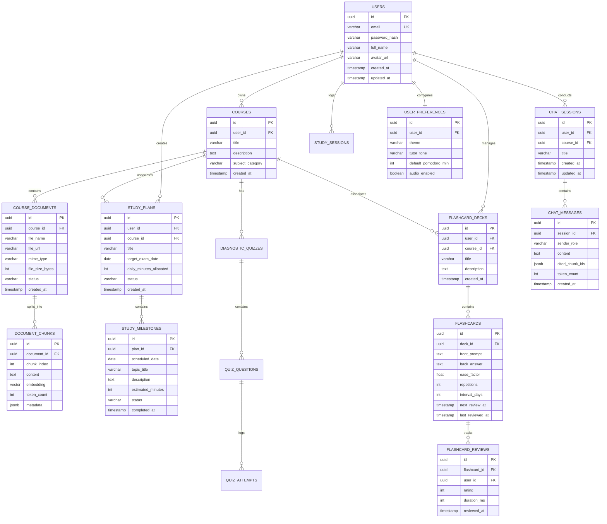

# Database Architecture & Schema Design
## Project: AI Study Mentor
**Version:** 1.0.0  
**Status:** Approved  
**Author:** AI Product & Engineering Team  
**Last Updated:** 2026-08-28  

---

## 1. Entity-Relationship Diagram (ERD)



---

## 2. Table Specifications & SQL DDL

```sql
-- Enable Extensions
CREATE EXTENSION IF NOT EXISTS "uuid-ossp";
CREATE EXTENSION IF NOT EXISTS "vector";

-- 1. Users Table
CREATE TABLE users (
    id UUID PRIMARY KEY DEFAULT uuid_generate_v4(),
    email VARCHAR(255) NOT NULL UNIQUE,
    password_hash VARCHAR(255) NOT NULL,
    full_name VARCHAR(150) NOT NULL,
    avatar_url VARCHAR(500),
    is_active BOOLEAN DEFAULT TRUE,
    created_at TIMESTAMPTZ DEFAULT CURRENT_TIMESTAMP,
    updated_at TIMESTAMPTZ DEFAULT CURRENT_TIMESTAMP
);

-- 2. User Preferences Table
CREATE TABLE user_preferences (
    id UUID PRIMARY KEY DEFAULT uuid_generate_v4(),
    user_id UUID NOT NULL UNIQUE REFERENCES users(id) ON DELETE CASCADE,
    theme VARCHAR(30) DEFAULT 'dark',
    tutor_tone VARCHAR(50) DEFAULT 'socratic_supportive',
    default_pomodoro_min INT DEFAULT 25,
    audio_enabled BOOLEAN DEFAULT FALSE,
    created_at TIMESTAMPTZ DEFAULT CURRENT_TIMESTAMP,
    updated_at TIMESTAMPTZ DEFAULT CURRENT_TIMESTAMP
);

-- 3. Courses / Subject Modules
CREATE TABLE courses (
    id UUID PRIMARY KEY DEFAULT uuid_generate_v4(),
    user_id UUID NOT NULL REFERENCES users(id) ON DELETE CASCADE,
    title VARCHAR(255) NOT NULL,
    description TEXT,
    subject_category VARCHAR(100),
    created_at TIMESTAMPTZ DEFAULT CURRENT_TIMESTAMP,
    updated_at TIMESTAMPTZ DEFAULT CURRENT_TIMESTAMP
);

-- 4. Course Documents
CREATE TABLE course_documents (
    id UUID PRIMARY KEY DEFAULT uuid_generate_v4(),
    course_id UUID NOT NULL REFERENCES courses(id) ON DELETE CASCADE,
    file_name VARCHAR(255) NOT NULL,
    file_url VARCHAR(1000) NOT NULL,
    mime_type VARCHAR(100) NOT NULL,
    file_size_bytes BIGINT NOT NULL,
    status VARCHAR(50) DEFAULT 'PENDING' CHECK (status IN ('PENDING', 'PROCESSING', 'COMPLETED', 'FAILED')),
    error_message TEXT,
    created_at TIMESTAMPTZ DEFAULT CURRENT_TIMESTAMP,
    updated_at TIMESTAMPTZ DEFAULT CURRENT_TIMESTAMP
);

-- 5. Document Chunks with Vector Embeddings (1536-dim)
CREATE TABLE document_chunks (
    id UUID PRIMARY KEY DEFAULT uuid_generate_v4(),
    document_id UUID NOT NULL REFERENCES course_documents(id) ON DELETE CASCADE,
    chunk_index INT NOT NULL,
    content TEXT NOT NULL,
    embedding VECTOR(1536),
    token_count INT NOT NULL,
    metadata JSONB DEFAULT '{}'::jsonb,
    created_at TIMESTAMPTZ DEFAULT CURRENT_TIMESTAMP
);

-- 6. Study Plans
CREATE TABLE study_plans (
    id UUID PRIMARY KEY DEFAULT uuid_generate_v4(),
    user_id UUID NOT NULL REFERENCES users(id) ON DELETE CASCADE,
    course_id UUID NOT NULL REFERENCES courses(id) ON DELETE CASCADE,
    title VARCHAR(255) NOT NULL,
    target_exam_date DATE NOT NULL,
    daily_minutes_allocated INT DEFAULT 45,
    status VARCHAR(50) DEFAULT 'ACTIVE' CHECK (status IN ('ACTIVE', 'COMPLETED', 'ARCHIVED')),
    created_at TIMESTAMPTZ DEFAULT CURRENT_TIMESTAMP,
    updated_at TIMESTAMPTZ DEFAULT CURRENT_TIMESTAMP
);

-- 7. Study Milestones (Calendar Tasks)
CREATE TABLE study_milestones (
    id UUID PRIMARY KEY DEFAULT uuid_generate_v4(),
    plan_id UUID NOT NULL REFERENCES study_plans(id) ON DELETE CASCADE,
    scheduled_date DATE NOT NULL,
    topic_title VARCHAR(255) NOT NULL,
    description TEXT,
    estimated_minutes INT DEFAULT 30,
    status VARCHAR(50) DEFAULT 'PENDING' CHECK (status IN ('PENDING', 'COMPLETED', 'SKIPPED')),
    completed_at TIMESTAMPTZ,
    created_at TIMESTAMPTZ DEFAULT CURRENT_TIMESTAMP,
    updated_at TIMESTAMPTZ DEFAULT CURRENT_TIMESTAMP
);

-- 8. Flashcard Decks
CREATE TABLE flashcard_decks (
    id UUID PRIMARY KEY DEFAULT uuid_generate_v4(),
    user_id UUID NOT NULL REFERENCES users(id) ON DELETE CASCADE,
    course_id UUID REFERENCES courses(id) ON DELETE SET NULL,
    title VARCHAR(255) NOT NULL,
    description TEXT,
    created_at TIMESTAMPTZ DEFAULT CURRENT_TIMESTAMP,
    updated_at TIMESTAMPTZ DEFAULT CURRENT_TIMESTAMP
);

-- 9. Flashcards with SM-2 Spaced Repetition Fields
CREATE TABLE flashcards (
    id UUID PRIMARY KEY DEFAULT uuid_generate_v4(),
    deck_id UUID NOT NULL REFERENCES flashcard_decks(id) ON DELETE CASCADE,
    front_prompt TEXT NOT NULL,
    back_answer TEXT NOT NULL,
    ease_factor FLOAT NOT NULL DEFAULT 2.50,
    repetitions INT NOT NULL DEFAULT 0,
    interval_days INT NOT NULL DEFAULT 0,
    next_review_at TIMESTAMPTZ NOT NULL DEFAULT CURRENT_TIMESTAMP,
    last_reviewed_at TIMESTAMPTZ,
    created_at TIMESTAMPTZ DEFAULT CURRENT_TIMESTAMP,
    updated_at TIMESTAMPTZ DEFAULT CURRENT_TIMESTAMP
);

-- 10. Flashcard Review Logs
CREATE TABLE flashcard_reviews (
    id UUID PRIMARY KEY DEFAULT uuid_generate_v4(),
    flashcard_id UUID NOT NULL REFERENCES flashcards(id) ON DELETE CASCADE,
    user_id UUID NOT NULL REFERENCES users(id) ON DELETE CASCADE,
    rating SMALLINT NOT NULL CHECK (rating BETWEEN 0 AND 5),
    duration_ms INT NOT NULL,
    reviewed_at TIMESTAMPTZ DEFAULT CURRENT_TIMESTAMP
);

-- 11. Chat Sessions & Socratic Transcripts
CREATE TABLE chat_sessions (
    id UUID PRIMARY KEY DEFAULT uuid_generate_v4(),
    user_id UUID NOT NULL REFERENCES users(id) ON DELETE CASCADE,
    course_id UUID REFERENCES courses(id) ON DELETE SET NULL,
    title VARCHAR(255) DEFAULT 'New Study Session',
    created_at TIMESTAMPTZ DEFAULT CURRENT_TIMESTAMP,
    updated_at TIMESTAMPTZ DEFAULT CURRENT_TIMESTAMP
);

CREATE TABLE chat_messages (
    id UUID PRIMARY KEY DEFAULT uuid_generate_v4(),
    session_id UUID NOT NULL REFERENCES chat_sessions(id) ON DELETE CASCADE,
    sender_role VARCHAR(20) NOT NULL CHECK (sender_role IN ('user', 'assistant', 'system')),
    content TEXT NOT NULL,
    cited_chunk_ids JSONB DEFAULT '[]'::jsonb,
    token_count INT DEFAULT 0,
    created_at TIMESTAMPTZ DEFAULT CURRENT_TIMESTAMP
);

-- 12. Focus Study Sessions (Pomodoro)
CREATE TABLE study_sessions (
    id UUID PRIMARY KEY DEFAULT uuid_generate_v4(),
    user_id UUID NOT NULL REFERENCES users(id) ON DELETE CASCADE,
    course_id UUID REFERENCES courses(id) ON DELETE SET NULL,
    duration_minutes INT NOT NULL,
    session_type VARCHAR(50) DEFAULT 'POMODORO' CHECK (session_type IN ('POMODORO', 'FLASHCARD_PRACTICE', 'DIAGNOSTIC_QUIZ', 'AI_TUTOR')),
    notes TEXT,
    completed_at TIMESTAMPTZ DEFAULT CURRENT_TIMESTAMP
);
```

---

## 3. Database Indexes & Query Optimizations

```sql
-- HNSW Vector Index for Instant Cosine Similarity Search (< 50ms)
CREATE INDEX idx_document_chunks_embedding_hnsw 
ON document_chunks 
USING hnsw (embedding vector_cosine_ops) 
WITH (m = 16, ef_construction = 64);

-- Foreign Key & Filter Indexes
CREATE INDEX idx_document_chunks_doc_id ON document_chunks(document_id);
CREATE INDEX idx_study_milestones_plan_date ON study_milestones(plan_id, scheduled_date);
CREATE INDEX idx_flashcards_deck_next_review ON flashcards(deck_id, next_review_at);
CREATE INDEX idx_flashcard_reviews_user ON flashcard_reviews(user_id, reviewed_at);
CREATE INDEX idx_chat_messages_session ON chat_messages(session_id, created_at ASC);
CREATE INDEX idx_study_sessions_user_date ON study_sessions(user_id, completed_at);

-- GIN Index on Chunk Metadata for Fast Tag/Chapter Filtering
CREATE INDEX idx_document_chunks_metadata_gin ON document_chunks USING gin (metadata);
```
