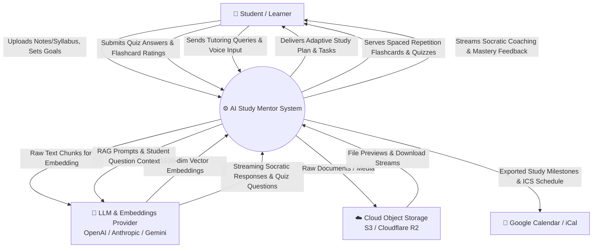
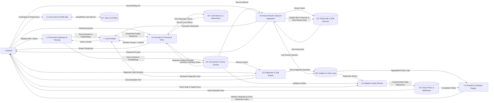
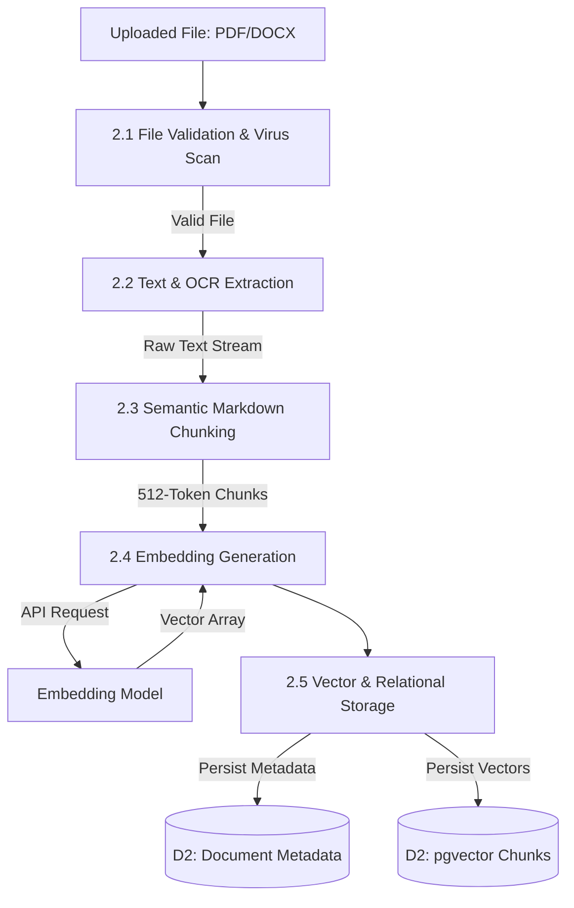
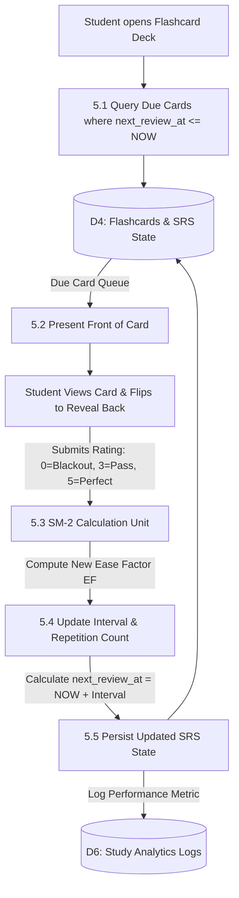

# Data Flow Diagrams (DFD)
## Project: AI Study Mentor
**Version:** 1.0.0  
**Status:** Approved  
**Author:** AI Product & Engineering Team  
**Last Updated:** 2026-08-28  

---

## 1. DFD Level 0: Context Diagram

The Level 0 Context Diagram establishes the boundary of the **AI Study Mentor** platform, depicting external entities and primary information exchanges.



---

## 2. DFD Level 1: Major System Processes

The Level 1 Diagram decomposes the system into 7 major operational subsystems and maps their interactions with data stores.



---

## 3. DFD Level 2: Detailed Subsystem Flows

### 3.1. Process 2.0: Document Ingestion & Chunking Flow (Level 2)



### 3.2. Process 5.0: Spaced Repetition (SRS) Engine Flow (Level 2)



### 3.3. Process 6.0: Socratic RAG Tutoring Flow (Level 2)

```mermaid
graph TD
    Query[Student Asks: 'Why does gradient descent oscillate in narrow ravines?'] --> P6_1[6.1 Query Embedding & Intent Classification]
    P6_1 --> P6_2[6.2 Hybrid Vector + BM25 Search]
    P6_2 --> D2_Vec[(D2: pgvector Chunks)]
    D2_Vec -->|Top K Excerpts (K=5)| P6_3[6.3 Context Reranking & Assembly]
    P6_3 --> P6_4[6.4 Socratic System Prompt Injection]
    P6_4 --> D5_Mem[(D5: Chat Memory / Session Context)]
    D5_Mem -->|Last 10 turns| P6_4
    P6_4 --> P6_5[6.5 Stream Completion from LLM]
    P6_5 --> Client[Server-Sent Event Stream to Client]
    P6_5 -->|Save Turn to History| D5_Mem
```

---

## 4. Data Store Inventory & Data Dictionary

| Store ID | Name | Contents | Data Retention |
| :--- | :--- | :--- | :--- |
| **D1** | `users` | User credentials, profiles, timezone, study goal settings. | Permanent (until account deletion). |
| **D2** | `documents` & `document_chunks` | Raw extracted texts, metadata, 1536-dim vector embeddings. | Retained per course lifecycle. |
| **D3** | `study_plans` & `milestones` | Calendared study schedules, time allotments, completion status. | Retained across student academic semesters. |
| **D4** | `flashcard_decks` & `flashcards` | Front/Back text, SM-2 Ease Factor, repetition count, next review date. | Permanent per user account. |
| **D5** | `chat_sessions` & `messages` | Transcripts of student-AI tutor dialogue, token usage, feedback ratings. | 180 days active memory. |
| **D6** | `study_logs` & `quiz_attempts` | Timestamped practice logs, response times, diagnostic scores, streaks. | Aggregated permanently for analytics. |
