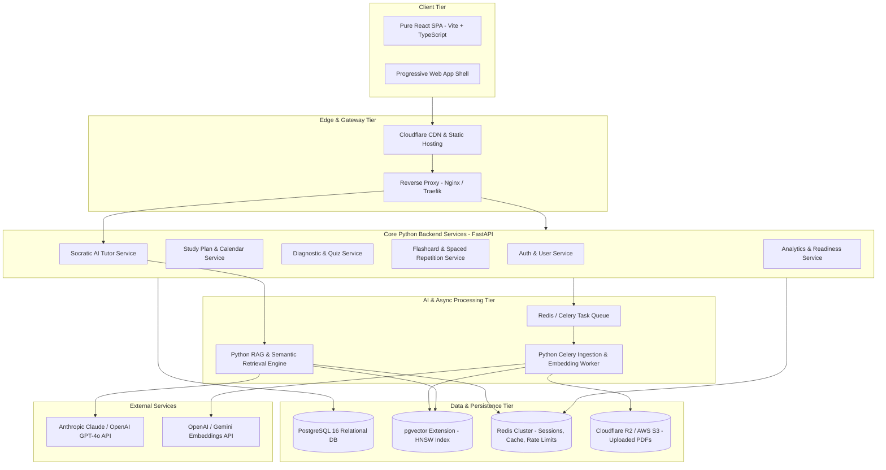
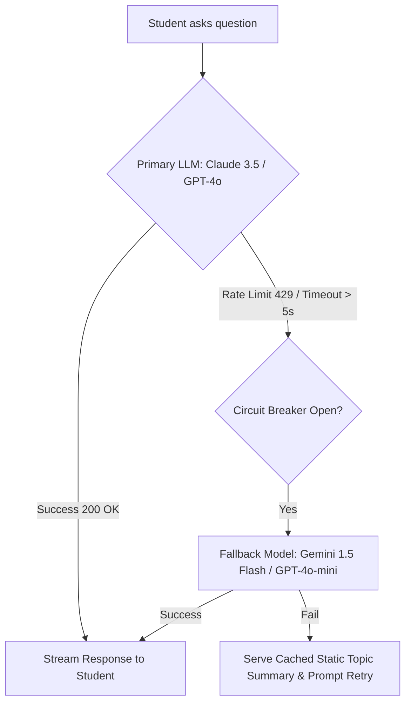
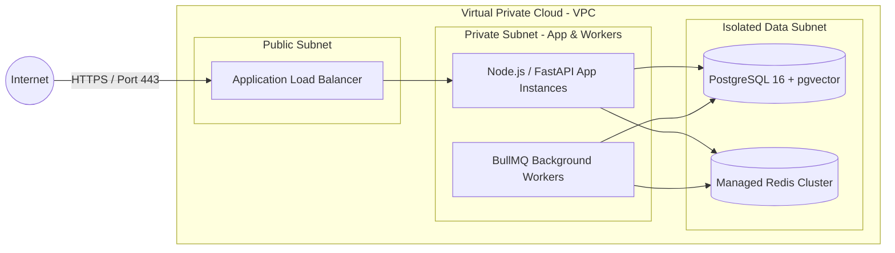

# High-Level Design (HLD)
## Project: AI Study Mentor
**Version:** 1.0.0  
**Status:** Approved  
**Author:** AI Product & Engineering Team  
**Last Updated:** 2026-08-28  

---

## 1. System Architectural Overview

The **AI Study Mentor** is architected as a modular, cloud-native micro-monolith (scalable into microservices as load grows), emphasizing high responsiveness, real-time streaming, and resilient AI orchestration.

---

## 2. Component Decomposition & Responsibilities

### 2.1. Client Tier (Pure React SPA - Vite)
- **Framework**: Pure React (Vite, React 19, TypeScript/JS, React Router v7).
- **Core Modules**:
  - `StudyPlannerView`: Interactive calendar displaying scheduled study milestones, drag-and-drop rescheduling, and target milestone checklists.
  - `SocraticChatView`: Streaming markdown chat interface with mathematical formula rendering ($\LaTeX$ / KaTeX), code syntax highlighting, and voice I/O.
  - `FlashcardDeckView`: 3D card-flip animations, keyboard shortcuts (`Space` to flip, `1-4` for ratings), and progress rings.
  - `DiagnosticQuizModal`: Step-by-step interactive assessment with immediate conceptual breakdown.
  - `FocusMode`: Fullscreen distraction-free timer with ambient lo-fi player.

### 2.2. Backend Tier (Python FastAPI + Asyncpg + SQLAlchemy)
- **FastAPI Core**: Async route handlers with automatic OpenAPI/Swagger documentation (`/docs`).
- **Rate Limiter**: Redis Token-bucket algorithm per IP and authenticated User ID (`slowapi`).
- **Auth Interceptor**: OAuth2 Password Bearer with JWT validation, dependency injection for `get_current_user`.
- **SSE Stream Handler**: Asynchronous generators (`StreamingResponse`) yielding `text/event-stream` chunks.

### 2.3. Core Domain Services
1. **User & Auth Service**: Handles registration, OAuth2 identity federation, session validation, and user learning preferences.
2. **Study Plan & Calendar Service**: Calculates syllabus segment distribution across student deadlines using workload balancing heuristics.
3. **Flashcard & SRS Service**: Implements SM-2 spaced repetition state transitions, card generation pipelines, and deck categorization.
4. **Diagnostic & Quiz Service**: Orchestrates dynamic question generation from syllabus topics, evaluates answers, and produces concept mastery matrices.
5. **Analytics & Readiness Service**: Aggregates study session durations, calculates streak continuity, and runs readiness forecast calculations.

### 2.4. AI & RAG Orchestration Service
- **Semantic Chunk Retriever**: Queries `pgvector` using cosine distance with MMR (Maximal Marginal Relevance) to balance relevance and diversity.
- **Context Reranker**: Optionally reranks top-15 retrieved chunks to feed top-5 highest-yield excerpts to the LLM.
- **Socratic Prompt Pipeline**: Injects conversation history, syllabus context, and Socratic pedagogical rules.

---

## 3. Communication Protocols & Data Contracts

| Interaction | Protocol | Format | Use Case |
| :--- | :--- | :--- | :--- |
| **Client $\leftrightarrow$ Server CRUD** | HTTPS / REST | JSON | User profiles, deck management, plan creation, quiz submission. |
| **Socratic AI Streaming** | HTTPS / Server-Sent Events (SSE) | `text/event-stream` | Streaming token-by-token tutor responses to client. |
| **Document Ingestion Jobs** | Async Task Queue | BullMQ over Redis | Non-blocking extraction and embedding of large textbooks. |
| **Vector Similarity Queries** | PostgreSQL Protocol | SQL with `<=>` Operator | In-database vector cosine similarity ranking. |

---

## 4. Resilience, Fault Tolerance & Graceful Degradation

- **Circuit Breakers**: Wraps external LLM provider calls with a 3-strike threshold. If timeouts exceed 5 seconds, traffic automatically fails over to a secondary model provider.
- **Database Connection Pooling**: PgBouncer / Prisma connection pooling with max pool limits to prevent connection exhaustion under spiky loads.
- **Optimistic UI Updates**: Flashcard reviews and milestone check-offs update the local client state immediately, queuing offline sync if network connectivity drops.

---

## 5. Security & Infrastructure Topology

- **Zero-Trust Network**: Databases and Redis caches are strictly isolated in private subnets with no public IP exposure.
- **Secrets Management**: Environment variables and API keys (OpenAI/Anthropic keys) are injected at runtime via encrypted secrets managers.
- **PII Scrubbing**: Student personal information is stripped from RAG chunks before embedding.
