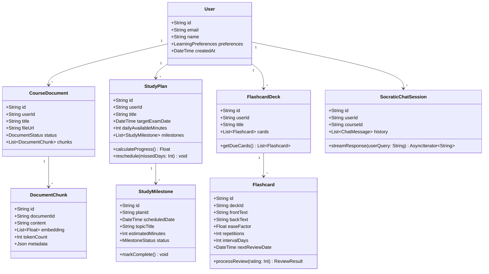
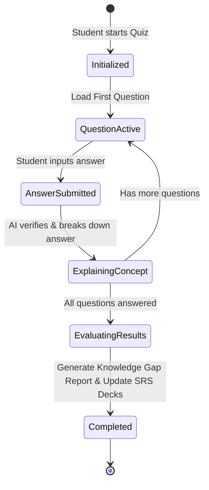
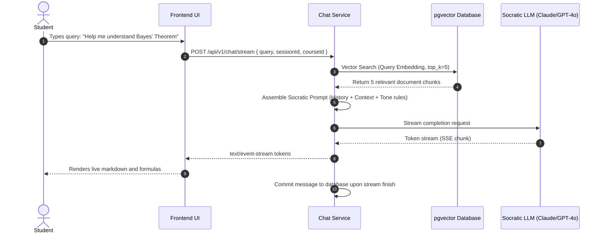

# Low-Level Design (LLD)
## Project: AI Study Mentor
**Version:** 1.0.0  
**Status:** Approved  
**Author:** AI Product & Engineering Team  
**Last Updated:** 2026-08-28  

---

## 1. Class & Module Architecture

The following class diagram outlines the primary domain models, services, and orchestration managers within the **AI Study Mentor** core engine.



---

## 2. Core Service Interfaces & TypeScript Contracts

### 2.1. Spaced Repetition (SRS) Engine
```typescript
export interface FlashcardReviewInput {
  cardId: string;
  rating: 0 | 1 | 2 | 3 | 4 | 5; // 0=Blackout, 3=Pass with effort, 5=Perfect instant recall
  reviewDurationMs: number;
}

export interface FlashcardReviewResult {
  cardId: string;
  previousEaseFactor: number;
  newEaseFactor: number;
  previousInterval: number;
  newIntervalDays: number;
  repetitions: number;
  nextReviewDate: Date;
}

export class SpacedRepetitionService {
  public calculateSM2(
    currentEF: number,
    currentRepetitions: number,
    currentInterval: number,
    rating: number
  ): { easeFactor: number; repetitions: number; intervalDays: number; nextReviewDate: Date } {
    // 1. Calculate new Ease Factor (EF)
    let newEF = currentEF + (0.1 - (5 - rating) * (0.08 + (5 - rating) * 0.02));
    if (newEF < 1.3) newEF = 1.3;

    let newReps = currentRepetitions;
    let newInterval = currentInterval;

    // 2. Determine repetition count & interval
    if (rating < 3) {
      // Failed recall - reset repetitions
      newReps = 0;
      newInterval = 1;
    } else {
      // Successful recall
      if (newReps === 0) {
        newInterval = 1;
      } else if (newReps === 1) {
        newInterval = 6;
      } else {
        newInterval = Math.round(currentInterval * newEF);
      }
      newReps += 1;
    }

    const nextReviewDate = new Date();
    nextReviewDate.setDate(nextReviewDate.getDate() + newInterval);

    return {
      easeFactor: Number(newEF.toFixed(2)),
      repetitions: newReps,
      intervalDays: newInterval,
      nextReviewDate,
    };
  }
}
```

---

### 2.2. Adaptive Study Plan Balancer
```typescript
export interface StudyPlanCreationParams {
  userId: string;
  courseTitle: string;
  targetExamDate: Date;
  dailyAvailableMinutes: number;
  topics: Array<{
    title: string;
    estimatedDifficulty: 1 | 2 | 3 | 4 | 5;
    prerequisiteTopicIds?: string[];
  }>;
}

export class AdaptivePlannerService {
  public generatePlan(params: StudyPlanCreationParams): Array<{ date: Date; topicTitle: string; allocatedMinutes: number }> {
    const today = new Date();
    const totalDaysAvailable = Math.max(1, Math.floor((params.targetExamDate.getTime() - today.getTime()) / (1000 * 60 * 60 * 24)));
    
    // Allocate 15% of the final days for comprehensive revision & mock exams
    const learningDays = Math.max(1, Math.floor(totalDaysAvailable * 0.85));
    const totalDifficultyWeight = params.topics.reduce((acc, t) => acc + t.estimatedDifficulty, 0);

    const schedule: Array<{ date: Date; topicTitle: string; allocatedMinutes: number }> = [];
    let currentDayOffset = 0;

    for (const topic of params.topics) {
      const topicDays = Math.max(1, Math.round((topic.estimatedDifficulty / totalDifficultyWeight) * learningDays));
      
      for (let i = 0; i < topicDays; i++) {
        const milestoneDate = new Date(today);
        milestoneDate.setDate(today.getDate() + currentDayOffset);
        
        schedule.push({
          date: milestoneDate,
          topicTitle: i === 0 ? `Learn: ${topic.title}` : `Deep Dive & Practice: ${topic.title}`,
          allocatedMinutes: params.dailyAvailableMinutes,
        });
        currentDayOffset++;
      }
    }

    // Append Final Spaced Revision Blocks
    while (currentDayOffset < totalDaysAvailable) {
      const revisionDate = new Date(today);
      revisionDate.setDate(today.getDate() + currentDayOffset);
      schedule.push({
        date: revisionDate,
        topicTitle: `Active Recall & Mock Diagnostic Test #${currentDayOffset - learningDays + 1}`,
        allocatedMinutes: params.dailyAvailableMinutes,
      });
      currentDayOffset++;
    }

    return schedule;
  }
}
```

---

## 3. Finite State Machines (FSM)

### 3.1. Diagnostic & Quiz Session State Machine



---

### 3.2. Socratic RAG Execution Pipeline Flow



---

## 4. Error Handling & Recovery Matrix

| Failure Mode | Detection | Automated Recovery Action | User-Facing Notification |
| :--- | :--- | :--- | :--- |
| **PDF Extraction Error (Corrupt / Password-protected)** | Parsing worker throws unreadable file error. | Worker tags document status as `FAILED_EXTRACTION`. | *"We couldn't read this PDF. Please ensure it is not password-protected or upload a text version."* |
| **LLM Rate Limit / 429 Quota Exhaustion** | HTTP status 429 received from primary LLM provider. | Immediate retry with exponential backoff; fallback to backup LLM (e.g. Gemini 1.5 Flash). | Transparent to student (seamless failover). |
| **Vector DB Latency Spike (> 2000ms)** | Database query timeout event. | Fall back to full-text BM25 search over document chunks. | Instant response with slight degraded search precision. |
| **Missed Study Schedule Days** | Cron job detects uncompleted milestones where date < today. | Trigger adaptive rescheduling dialog on next user login. | *"Life happens! We've adjusted your study plan to keep you on track without extra stress."* |
