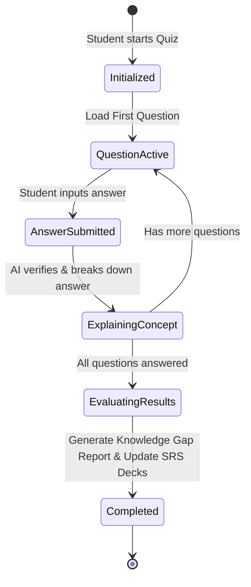
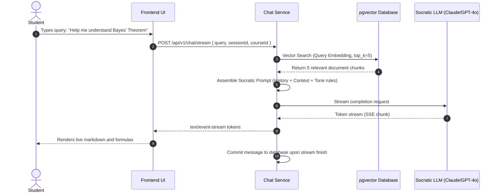

# Low-Level Design (LLD)
## Project: AI Study Mentor
**Version:** 1.0.0  
**Status:** Approved  
**Author:** AI Product & Engineering Team  
**Last Updated:** 2026-08-28  

---

## 1. Class & Module Architecture

The following class diagram outlines the primary domain models, services, and orchestration managers within the **AI Study Mentor** core engine.


---

## 2. Core Service Interfaces & Python Data Contracts

### 2.1. Spaced Repetition (SRS) Engine (Python)
```python
from datetime import datetime, timedelta
from typing import Literal, Tuple
from pydantic import BaseModel, Field


class FlashcardReviewInput(BaseModel):
    card_id: str
    rating: Literal[0, 1, 2, 3, 4, 5]  # 0=Blackout, 3=Pass with effort, 5=Perfect instant recall
    duration_ms: int = Field(ge=0)


class FlashcardReviewResult(BaseModel):
    card_id: str
    previous_ease_factor: float
    new_ease_factor: float
    previous_interval: int
    new_interval_days: int
    repetitions: int
    next_review_date: datetime


class SpacedRepetitionService:
    @staticmethod
    def calculate_sm2(
        current_ef: float,
        current_repetitions: int,
        current_interval: int,
        rating: int
    ) -> Tuple[float, int, int, datetime]:
        """
        Executes SuperMemo SM-2 algorithm in pure Python.
        """
        # 1. Calculate new Ease Factor (EF)
        new_ef = current_ef + (0.1 - (5 - rating) * (0.08 + (5 - rating) * 0.02))
        if new_ef < 1.3:
            new_ef = 1.3

        new_reps = current_repetitions
        new_interval = current_interval

        # 2. Determine repetition count & interval
        if rating < 3:
            # Failed recall - reset repetitions
            new_reps = 0
            new_interval = 1
        else:
            # Successful recall
            if new_reps == 0:
                new_interval = 1
            elif new_reps == 1:
                new_interval = 6
            else:
                new_interval = round(current_interval * new_ef)
            new_reps += 1

        next_review_date = datetime.utcnow() + timedelta(days=new_interval)

        return round(new_ef, 2), new_reps, new_interval, next_review_date
```

---

### 2.2. Adaptive Study Plan Balancer (Python)
```python
from datetime import datetime, date, timedelta
from typing import List, Optional
from pydantic import BaseModel, Field


class TopicRequirement(BaseModel):
    title: str
    estimated_difficulty: int = Field(ge=1, le=5)
    prerequisite_ids: Optional[List[str]] = None


class StudyPlanCreationParams(BaseModel):
    user_id: str
    course_title: str
    target_exam_date: date
    daily_available_minutes: int = 45
    topics: List[TopicRequirement]


class MilestoneOutput(BaseModel):
    scheduled_date: date
    topic_title: str
    allocated_minutes: int


class AdaptivePlannerService:
    @staticmethod
    def generate_plan(params: StudyPlanCreationParams) -> List[MilestoneOutput]:
        today = date.today()
        total_days_available = max(1, (params.target_exam_date - today).days)

        # Allocate 15% of final days for comprehensive revision & mock exams
        learning_days = max(1, int(total_days_available * 0.85))
        total_difficulty_weight = sum(t.estimated_difficulty for t in params.topics) or 1

        schedule: List[MilestoneOutput] = []
        current_day_offset = 0

        for topic in params.topics:
            topic_days = max(1, round((topic.estimated_difficulty / total_difficulty_weight) * learning_days))
            for i in range(topic_days):
                milestone_date = today + timedelta(days=current_day_offset)
                title = f"Learn: {topic.title}" if i == 0 else f"Deep Dive & Practice: {topic.title}"
                schedule.append(MilestoneOutput(
                    scheduled_date=milestone_date,
                    topic_title=title,
                    allocated_minutes=params.daily_available_minutes
                ))
                current_day_offset += 1

        # Append Final Spaced Revision Blocks
        while current_day_offset < total_days_available:
            revision_date = today + timedelta(days=current_day_offset)
            schedule.append(MilestoneOutput(
                scheduled_date=revision_date,
                topic_title=f"Active Recall & Mock Diagnostic Test #{current_day_offset - learning_days + 1}",
                allocated_minutes=params.daily_available_minutes
            ))
            current_day_offset += 1

        return schedule
```

---

## 3. Finite State Machines (FSM)

### 3.1. Diagnostic & Quiz Session State Machine



---

### 3.2. Socratic RAG Execution Pipeline Flow



---

## 4. Error Handling & Recovery Matrix

| Failure Mode | Detection | Automated Recovery Action | User-Facing Notification |
| :--- | :--- | :--- | :--- |
| **PDF Extraction Error (Corrupt / Password-protected)** | Parsing worker throws unreadable file error. | Worker tags document status as `FAILED_EXTRACTION`. | *"We couldn't read this PDF. Please ensure it is not password-protected or upload a text version."* |
| **LLM Rate Limit / 429 Quota Exhaustion** | HTTP status 429 received from primary LLM provider. | Immediate retry with exponential backoff; fallback to backup LLM (e.g. Gemini 1.5 Flash). | Transparent to student (seamless failover). |
| **Vector DB Latency Spike (> 2000ms)** | Database query timeout event. | Fall back to full-text BM25 search over document chunks. | Instant response with slight degraded search precision. |
| **Missed Study Schedule Days** | Cron job detects uncompleted milestones where date < today. | Trigger adaptive rescheduling dialog on next user login. | *"Life happens! We've adjusted your study plan to keep you on track without extra stress."* |
