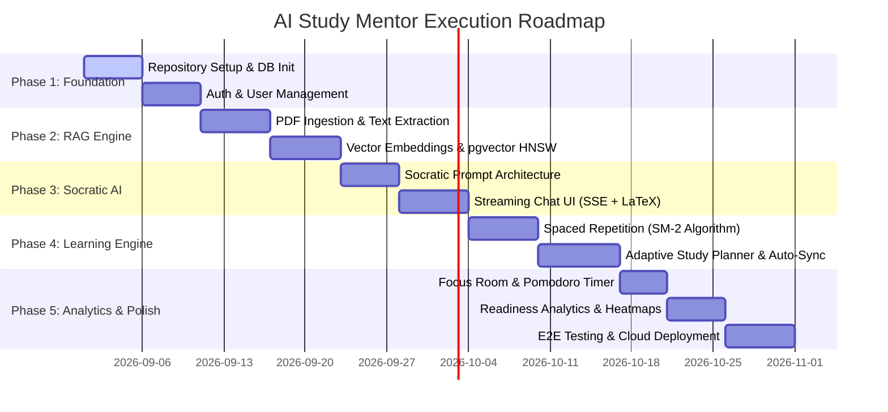

# Master Todo & Implementation Roadmap
## Project: AI Study Mentor
**Version:** 1.0.0  
**Status:** In Progress  
**Author:** AI Product & Engineering Team  
**Last Updated:** 2026-08-28  

---

## 1. Roadmap & Milestone Progress Overview

---

## 2. Sprint-by-Sprint Execution Checklist

### Phase 1: Project Scaffolding, Database & Auth
- [ ] **Task 1.1**: Initialize monorepo / workspace with Next.js 15 (App Router, TypeScript) and Node/FastAPI backend.
- [ ] **Task 1.2**: Provision PostgreSQL 16 database with `pgvector` and `uuid-ossp` extensions enabled.
- [ ] **Task 1.3**: Configure ORM schema (Prisma / Drizzle / SQLAlchemy) based on [DATABASE_DESIGN.md](file:///c:/Users/pragy/Documents/GitHub/Pathfinder-ML/doc/DATABASE_DESIGN.md).
- [ ] **Task 1.4**: Run baseline database migrations and generate typed database client contracts.
- [ ] **Task 1.5**: Implement user authentication endpoints (`/auth/register`, `/auth/login`, `/auth/refresh`) with Argon2 hashing and JWTs.
- [ ] **Task 1.6**: Build frontend authentication flow (Login, Sign Up, Session context provider).

---

### Phase 2: Document Processing, Chunking & Vector RAG Pipeline
- [ ] **Task 2.1**: Set up Cloudflare R2 / AWS S3 object storage for raw PDF/DOCX textbook uploads.
- [ ] **Task 2.2**: Build document upload endpoint (`POST /documents/upload`) with file validation.
- [ ] **Task 2.3**: Configure BullMQ / Redis background worker for text extraction and semantic markdown chunking (512 tokens).
- [ ] **Task 2.4**: Integrate OpenAI `text-embedding-3-small` / Gemini Embeddings API in the worker pipeline.
- [ ] **Task 2.5**: Implement HNSW index queries in PostgreSQL for cosine similarity search (`<=>`).
- [ ] **Task 2.6**: Build document management UI with upload dropzone and live processing status indicators.

---

### Phase 3: Socratic AI Tutor & Streaming Chat Engine
- [ ] **Task 3.1**: Implement Socratic System Prompt template with pedagogical guardrails (no direct answers, analogies first).
- [ ] **Task 3.2**: Build Server-Sent Events (SSE) streaming endpoint (`POST /chat/stream`) with RAG context injection.
- [ ] **Task 3.3**: Create interactive Socratic Chat UI with Markdown rendering, KaTeX math formatting ($\LaTeX$), and code highlight blocks.
- [ ] **Task 3.4**: Add quick Socratic interaction pills ("Explain with analogy", "Give me a hint", "Ask me a check question").
- [ ] **Task 3.5**: Implement chat history persistence and session switching.
- [ ] **Task 3.6**: (Optional) Integrate Web Speech API / Whisper transcription for hands-free voice study mode.

---

### Phase 4: Active Recall & Spaced Repetition (SRS)
- [ ] **Task 4.1**: Build automated flashcard generation endpoint (`POST /decks/generate-from-document`) extracting Q&A pairs from text chunks.
- [ ] **Task 4.2**: Implement SuperMemo SM-2 algorithm service with Ease Factor and interval calculations as specified in [LLD.md](file:///c:/Users/pragy/Documents/GitHub/Pathfinder-ML/doc/LLD.md).
- [ ] **Task 4.3**: Build 3D card flip Flashcard Review UI with keyboard shortcuts (`Space` to flip, `1-4` to rate).
- [ ] **Task 4.4**: Implement dynamic review queue (`GET /decks/:id/due-cards`) and review logging.
- [ ] **Task 4.5**: Add Anki (.apkg) export and manual card creation/editing modals.

---

### Phase 5: Adaptive Dynamic Study Planner
- [ ] **Task 5.1**: Build adaptive study plan generation algorithm based on target exam date and daily available study time.
- [ ] **Task 5.2**: Create interactive Calendar / Timeline UI displaying daily study milestones and progress ticks.
- [ ] **Task 5.3**: Build zero-guilt dynamic auto-rescheduling algorithm to re-balance missed days.
- [ ] **Task 5.4**: Add drag-and-drop milestone reordering and manual task completion check-offs.

---

### Phase 6: Focus Room, Pomodoro Timer & Gamification
- [ ] **Task 6.1**: Implement fullscreen Focus Mode with customizable Pomodoro timer (25/5 or 50/10 min).
- [ ] **Task 6.2**: Add ambient audio player (Lo-fi study beats, Rain, White noise).
- [ ] **Task 6.3**: Implement daily study streak counter with fire animation and streak freeze mechanisms.
- [ ] **Task 6.4**: Log focus time sessions to `study_sessions` table upon timer completion.

---

### Phase 7: Knowledge Gap Analytics & Exam Readiness
- [ ] **Task 7.1**: Build diagnostic quiz generator (`POST /quizzes/generate`) for pre-topic baseline assessment.
- [ ] **Task 7.2**: Implement topic mastery score aggregation based on quiz accuracy and flashcard retention rates.
- [ ] **Task 7.3**: Build Analytics Dashboard with knowledge gap heatmap and 0-100% Exam Readiness meter.
- [ ] **Task 7.4**: Implement AI recommendations widget flagging weakest concepts with direct 1-click action items.

---

### Phase 8: Quality Assurance, Testing & Deployment
- [ ] **Task 8.1**: Write unit tests for SM-2 Spaced Repetition and Adaptive Planner algorithms.
- [ ] **Task 8.2**: Write API integration tests for all auth, document, chat, and deck endpoints.
- [ ] **Task 8.3**: Conduct accessibility (WCAG 2.1 AA) and cross-browser responsiveness audit.
- [ ] **Task 8.4**: Configure GitHub Actions CI/CD pipeline and Docker multi-stage container builds.
- [ ] **Task 8.5**: Deploy database (PostgreSQL + pgvector), API services, and Next.js frontend to production cloud environment.
