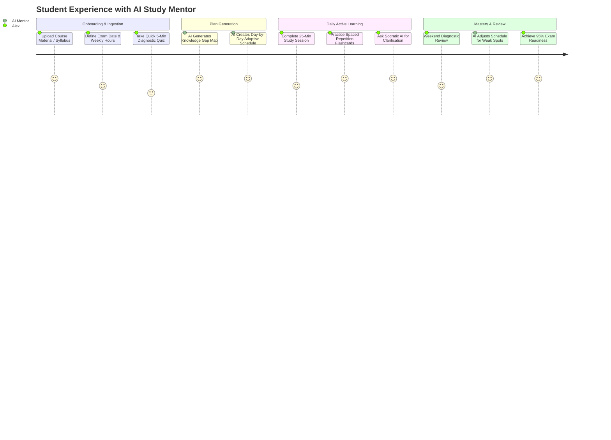

# Product Requirements Document (PRD)
## Project: AI Study Mentor
**Version:** 1.0.0  
**Status:** Approved  
**Author:** AI Product & Engineering Team  
**Last Updated:** 2026-08-28  

---

## 1. Executive Summary & Vision
The **AI Study Mentor** is an intelligent, highly supportive personal study coach that fits directly inside a student or learner's computer. Modern learners suffer from information overload, study procrastination, disorganized materials, suboptimal revision methods (e.g., passive re-reading), and exam anxiety.

**AI Study Mentor** eliminates the friction and stress in learning by:
1. **Accurately diagnosing** what the student knows vs. where their learning gaps exist.
2. **Generating hyper-personalized, adaptive study schedules** based on deadlines, mastery pace, and availability.
3. **Powering high-retention active recall** through automated flashcard decks, spaced repetition (SM-2 / Leitner algorithms), conceptual quizzes, and mind maps.
4. **Providing a 24/7 empathetic, Socratic AI Tutor** that explains complex topics in simple terms, guides without spoon-feeding answers, and cheers the student on.

---

## 2. Target Personas & Problem Statements

| Persona | Needs & Goals | Core Frustrations | How AI Study Mentor Solves It |
| :--- | :--- | :--- | :--- |
| **University / College Student (Alex, 20)** | Ace midterm and final exams across complex technical / academic subjects (STEM, Humanities). | Cramming before exams, unstructured notes, falling behind on syllabus timelines. | Diagnostic gap analysis, automatic syllabus breakdown into daily bite-sized micro-goals, Socratic AI coaching. |
| **Self-Paced Professional / Bootcamper (Maya, 28)** | Transition careers (Data Science, Cloud Engineering) while working full-time. | Limited free time (1-2 hrs/day), fatigue, lack of accountability and direction. | Time-boxed study scheduling, flashcards with spaced repetition, contextual Q&A on docs and code. |
| **High School / Competitive Exam Candidate (Rohan, 17)** | Clear competitive entrance examinations (SAT, ACT, AP, JEE, NEET). | Memory retention issues, anxiety, repetitive practice on already-mastered concepts instead of weak spots. | Spaced repetition active recall, targeted diagnostic quizzes that specifically attack knowledge weak spots. |

---

## 3. Core Value Propositions & Key Features

### 3.1. Knowledge Diagnosis & Syllabus Ingestion
- **Document & Syllabus Ingestion**: Upload PDFs, lecture slides, syllabus outlines, web links, or raw text notes.
- **Diagnostic Pre-Assessment**: AI generates a brief 5-10 question dynamic diagnostic test to assess baseline competence before starting a module.
- **Knowledge Graph Gap Identification**: Visualizes topics mastered, partially understood, or unattempted.

### 3.2. Dynamic, Adaptive Study Planner
- **Deadline-Aware Calendaring**: Input exam date, available hours per day, and target mastery level.
- **Micro-Learning Milestones**: Breaks dense 500-page subjects into 20-30 minute focused study blocks.
- **Dynamic Rescheduling**: If a student misses a day or struggles with a topic, the calendar self-adjusts without overwhelming the student with backlog guilt.

### 3.3. Active Recall & Spaced Repetition Engine
- **Automated Flashcard & Cloze Generator**: Automatically extracts high-yield definitions, equations, and facts from study material.
- **Spaced Repetition System (SRS)**: Uses an enhanced SuperMemo SM-2 algorithm to schedule review intervals (1 day, 3 days, 7 days, 16 days, etc.).
- **Adaptive Practice Quizzes**: Multiple-choice, fill-in-the-blank, and open-ended questions with instant AI-driven conceptual explanations.

### 3.4. Supportive Socratic AI Study Coach
- **Socratic Tutoring Mode**: Prompts students to think through problems step-by-step rather than immediately revealing answers.
- **"Explain Like I'm 5" (ELI5) / Real-world Analogies**: Translates high-abstraction jargon into relatable mental models.
- **Emotional & Motivation Support**: Encouraging, warm persona that tracks study streaks, praises consistency, and mitigates burnout.
- **Voice / Speech-to-Text Support**: Audio interaction for quick verbal practice sessions while on the move.

### 3.5. Analytics & Progress Mastery
- **Retention & Mastery Index**: Quantitative 0-100% mastery score per chapter and topic.
- **Study Streak & Focus Timer**: Built-in Pomodoro timer with ambient focus music/sounds and streak tracking.
- **Exam Readiness Predictor**: Probabilistic score indicating estimated readiness for upcoming test dates.

---

## 4. User Journey Map

---

## 5. Functional Requirements

| ID | Feature Area | Description | Priority |
| :--- | :--- | :--- | :--- |
| **FR-01** | User Auth & Profiles | Secure email/password, OAuth2 (Google/GitHub), personal preferences (study pace, tone, theme). | P0 (Must Have) |
| **FR-02** | Content Ingestion | Upload PDF, DOCX, TXT, Markdown, YouTube URL, or paste syllabus; text extraction and vector chunking. | P0 (Must Have) |
| **FR-03** | Diagnostic Engine | Generate diagnostic quizzes from ingested materials and calculate topic proficiency scores. | P0 (Must Have) |
| **FR-04** | Adaptive Planner | Create, update, and auto-reschedule daily study tasks based on completion status and target date. | P0 (Must Have) |
| **FR-05** | Spaced Repetition | Flashcards generation with rating (Again, Hard, Good, Easy) and dynamic next-review scheduling. | P0 (Must Have) |
| **FR-06** | Socratic AI Tutor | Context-aware streaming conversational chat with RAG grounding, voice I/O, and tone adjustments. | P0 (Must Have) |
| **FR-07** | Pomodoro & Focus | Integrated timer (25/5 or customizable), background lo-fi/white noise, and session logging. | P1 (Should Have) |
| **FR-08** | Analytics Dashboard | Visual mastery heatmaps, retention curves, time spent, streak counters, and readiness forecast. | P1 (Should Have) |
| **FR-09** | Export & Sync | Export flashcards to Anki (.apkg), export summary sheets to PDF/Markdown, Google Calendar sync. | P2 (Nice to Have) |

---

## 6. Non-Functional Requirements (NFR)
- **Performance**: AI chat streaming First Token Latency (TTFT) < 600ms; quiz generation < 4s.
- **Availability & Reliability**: 99.9% uptime with offline flashcard caching for uninterrupted mobile/laptop study.
- **Security & Privacy**: End-to-end TLS 1.3 encryption, zero data sharing with third-party LLM training, GDPR/FERPA compliant.
- **Usability & Aesthetics**: Premium dark/light themes, WCAG 2.1 AA accessibility, keyboard-first navigation shortcuts.

---

## 7. Success Metrics & Key Performance Indicators (KPIs)
1. **Daily Active Learning Rate (DALR)**: $\ge 65\%$ of registered users completing $\ge 1$ daily study block.
2. **Concept Retention Rate**: $\ge 80\%$ average score on spaced review quizzes after 14 days.
3. **Study Plan Completion Rate**: $\ge 75\%$ of students sticking to their adaptive schedule until exam day.
4. **User Satisfaction / CSAT**: Net Promoter Score (NPS) $\ge +60$ and supportive persona feedback rating $\ge 4.8/5$.
