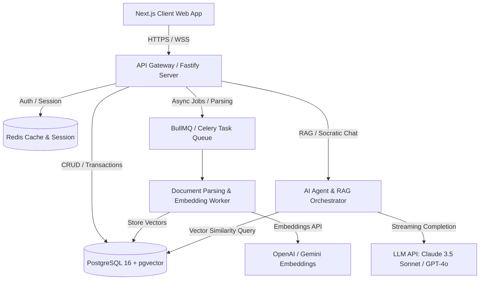
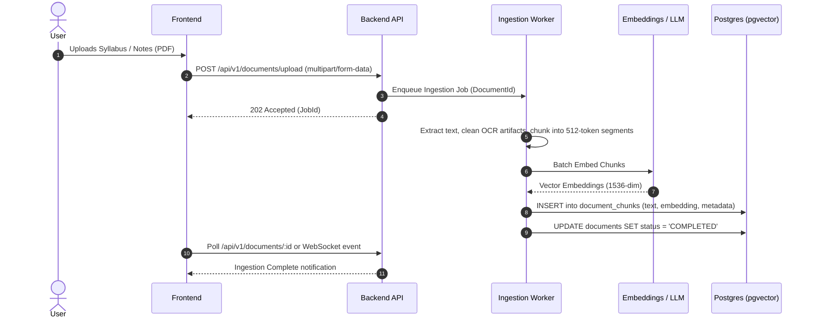

# Technical Requirements Document (TRD)
## Project: AI Study Mentor
**Version:** 1.0.0  
**Status:** Approved  
**Author:** AI Product & Engineering Team  
**Last Updated:** 2026-08-28  

---

## 1. System Overview & Technical Architecture

The **AI Study Mentor** platform consists of a modern, reactive client application, a high-throughput API gateway, an AI orchestration service with Retrieval-Augmented Generation (RAG), a relational database with vector search capabilities (`pgvector`), and a background task worker for document parsing and spaced-repetition scheduling.



---

## 2. Technology Stack & Rationale

| Layer | Technology | Version | Rationale |
| :--- | :--- | :--- | :--- |
| **Frontend Web App** | Next.js (App Router), React, TypeScript | 15.x / 19.x | SSR/SSG for rapid loading, Server Components, typed contracts, responsive layouts. |
| **Styling & UI** | TailwindCSS / CSS Modules, Lucide Icons, Framer Motion | Latest | Responsive layout, glassmorphism design tokens, micro-animations for study engagement. |
| **Backend API Gateway** | Node.js (Fastify / Express) or Python FastAPI | Latest | High concurrency, async I/O, native TypeScript/Python ecosystem, low memory overhead. |
| **Relational Database** | PostgreSQL | 16.x | ACID compliance, JSONB document storage, relational integrity for user schedules. |
| **Vector Search** | PostgreSQL `pgvector` extension | 0.7+ | Eliminates multi-database sync overhead by co-locating relational data and embeddings. |
| **Cache & Task Queue** | Redis + BullMQ | 7.x | High-speed token caching, user session management, background PDF ingestion queue. |
| **AI / LLM Orchestration**| LangChain / LlamaIndex + Vercel AI SDK | Latest | Streaming chat UI integration, RAG pipeline, semantic chunking, prompt template management. |
| **Document Extraction** | `pdf-parse`, `tesseract.js` (OCR), `mammoth` (DOCX)| Latest | Multi-format syllabus and textbook parsing directly to semantic markdown chunks. |
| **Authentication** | NextAuth.js / Supabase Auth / JWT | Latest | Secure OAuth2 (Google/GitHub) and email/password with Argon2 password hashing. |

---

## 3. Core Technical Subsystems

### 3.1. Document Ingestion & RAG Pipeline
1. **File Upload & Sanitization**: Max file size 50MB. File formats validated (PDF, DOCX, TXT, MD).
2. **Text Chunking & Preprocessing**:
   - Chunking Strategy: Recursive Character Splitting with hierarchical header awareness.
   - Chunk Size: 512 tokens with 64 token overlap.
   - Metadata Enrichment: Document ID, Page Number, Chapter Title, Section Header.
3. **Vector Embeddings**:
   - Model: `text-embedding-3-small` (1536 dims) or `gemini-embedding-exp-0827`.
   - Indexing: HNSW (Hierarchical Navigable Small World) with Cosine Distance (`vector_cosine_ops`).
4. **Hybrid Retrieval**:
   - Combined Full-Text Search (`tsvector` with BM25 ranking) + Dense Vector Similarity Search with Reciprocal Rank Fusion (RRF).



---

### 3.2. Spaced Repetition System (SRS) - Modified SM-2 Algorithm
The Spaced Repetition algorithm computes interval ($I$), repetition number ($n$), and ease factor ($EF$) based on student feedback rating $q \in \{0, 1, 2, 3, 4, 5\}$:

$$\text{EF}' = \text{EF} + \left(0.1 - (5 - q) \times (0.08 + (5 - q) \times 0.02)\right)$$
$$\text{Where } \text{EF}' \ge 1.3$$

**Interval Update Formula:**
- If $q < 3$ (Failed recall): $n = 0, I = 1 \text{ day}$
- If $q \ge 3$ (Successful recall):
  - $n = 1 \implies I_1 = 1 \text{ day}$
  - $n = 2 \implies I_2 = 6 \text{ days}$
  - $n > 2 \implies I_n = I_{n-1} \times \text{EF}'$

Next scheduled review timestamp: $\text{NextReviewDate} = \text{CurrentDate} + I_n \text{ days}$.

---

### 3.3. Socratic AI Prompting & Agent Pipeline
To prevent the model from blindly giving final solutions, the system applies a strict Socratic system directive:

```markdown
SYSTEM PROMPT:
You are an empathetic, world-class personal study coach and Socratic tutor.
Rules:
1. Always encourage the student and acknowledge their progress.
2. Ground your explanations in the provided context excerpts from their study materials.
3. NEVER directly solve homework or exam questions. Instead, ask guided questions to lead the student to discover the answer themselves.
4. Break down complex jargon into relatable real-world analogies.
5. Offer 3 follow-up comprehension check prompts at the end of every conceptual explanation.
```

---

## 4. Scalability, Security & Performance Specifications

### 4.1. Security & Compliance
- **Transport Layer**: Strict HTTPS with TLS 1.3, HSTS enabled, CORS restricted to verified domain origins.
- **Authentication & Authorization**: Bearer JWT tokens with 15-minute access lifespan and 30-day rotating Refresh Tokens stored in HTTP-only, SameSite=Strict cookies.
- **Input Sanitization**: HTML sanitization on all user markdown, SQL injection prevention via ORM parameterized queries (Prisma/Drizzle/SQLAlchemy).
- **Rate Limiting**: Redis Token Bucket limiter:
  - Auth endpoints: 5 requests / minute
  - AI Tutoring endpoints: 30 requests / minute
  - General CRUD endpoints: 120 requests / minute

### 4.2. Performance Benchmarks & SLAs

| Metric | Target SLA | Strategy |
| :--- | :--- | :--- |
| **API Response Time (CRUD)** | $< 120\text{ms}$ (p95) | Redis caching, indexed Postgres foreign keys. |
| **AI Stream First-Token Time** | $< 600\text{ms}$ (p90) | Server-Sent Events (SSE) streaming with low-latency LLM endpoints. |
| **Vector Retrieval Latency** | $< 50\text{ms}$ (p95) | `pgvector` HNSW indexes with `m=16, ef_construction=64`. |
| **Document Processing Speed** | $< 10\text{s}$ per 50 pages | Parallelized chunk embedding worker pool. |

---

## 5. Deployment, CI/CD & Observability

- **CI/CD Pipeline**: GitHub Actions running linting (ESLint), type checking (`tsc`), unit tests (`vitest` / `pytest`), and automated preview deployments.
- **Containerization**: Docker multi-stage builds with non-root Alpine runtime.
- **Observability**: OpenTelemetry tracing, Prometheus metrics for request latency/token usage, structured JSON logging with Winston/Pino, and Sentry error monitoring.
