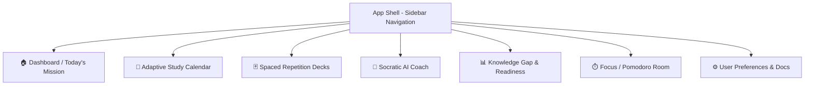

# UI & Wireframe Specifications
## Project: AI Study Mentor
**Version:** 1.0.0  
**Status:** Approved  
**Author:** AI Product & Engineering Team  
**Last Updated:** 2026-08-28  

---

## 1. Design System & Aesthetic Principles

The **AI Study Mentor** UI is designed to feel like a high-end, distraction-free, supportive sanctuary for learning. It utilizes a sleek modern dark mode with rich glassmorphic layers, vibrant accent glows (electric indigo, emerald green for mastery, warm amber for review warnings), and subtle micro-animations to inspire confidence and eliminate study fatigue.

### 1.1. Color Tokens & Palette

| Token Name | Hex Code | Purpose |
| :--- | :--- | :--- |
| `--bg-base` | `#0B0F19` | Deep cosmic midnight background. |
| `--bg-surface` | `#131B2E` | Card & container surface with 70% opacity glassmorphism. |
| `--bg-surface-elevated` | `#1E293B` | Hover states, modals, and flyout menus. |
| `--primary-accent` | `#6366F1` | Electric Indigo (Primary CTA, active states, AI highlights). |
| `--primary-glow` | `rgba(99, 102, 241, 0.25)` | Ambient glow behind key elements. |
| `--accent-success` | `#10B981` | Emerald Green (High mastery, completed streak, correct recall). |
| `--accent-warning` | `#F59E0B` | Amber (Due for review, intermediate gap). |
| `--accent-danger` | `#EF4444` | Coral Red (Needs immediate reinforcement, weak knowledge gap). |
| `--text-primary` | `#F8FAFC` | Crisp white for headings and active reading. |
| `--text-secondary` | `#94A3B8` | Muted slate for metadata and secondary guidance. |

### 1.2. Typography & Motion
- **Display Font**: `Outfit` / `Inter Display` (Clean, geometric, friendly).
- **Body Font**: `Inter` (Optimized for deep reading and comprehension).
- **Code / Math Font**: `Fira Code` & `KaTeX` for formula rendering.
- **Micro-Animations**:
  - Flashcard 3D flip duration: `0.35s ease-out`.
  - Progress bar filling: Spring physics with slight bounce.
  - Streak flame pulse: Subtle 2-second ambient breathing keyframe.

---

## 2. Navigation Architecture & Global Shell



---

## 3. Screen Wireframes & Detailed Layouts

### 3.1. Main Dashboard & Today's Study Mission Hub

```
+----------------------------------------------------------------------------------------------------+
|  [AI STUDY MENTOR]    📚 CS 301: Machine Learning   🔥 12-Day Streak   [⚡ 92% Ready]   (👤 Profile) |
+----------------------------------------------------------------------------------------------------+
|                                                                                                    |
|  👋 Welcome back, Alex! Let's conquer today's study block.                                        |
|  "Small daily improvements over time lead to stunning results."                                    |
|                                                                                                    |
|  +----------------------------------------------------+  +---------------------------------------+ |
|  | 🎯 TODAY'S MISSION (Est. 45 mins)                  |  | 📊 MASTERY SNAPSHOT                   | |
|  |                                                    |  |                                       | |
|  |  [ ] 1. Review 18 Due Flashcards (Spaced Rep.)     |  |  Linear Algebra:        [████████] 95%| |
|  |      Topic: Neural Net Backpropagation [Start]     |  |  Optimization & SGD:    [█████░░░] 68%| |
|  |                                                    |  |  Convolutional Nets:    [██░░░░░░] 30%| |
|  |  [ ] 2. Core Reading & Note Exploration (20m)      |  |                                       | |
|  |      Chapter 4: Loss Functions & Regularization    |  |  ⚠️ Weak Gap Detected:                | |
|  |                                                    |  |  "Vanishing Gradient Problem"         | |
|  |  [ ] 3. 5-Question Active Recall Check (10m)       |  |  [Ask AI Coach to Explain]            | |
|  |                                                    |  +---------------------------------------+ |
|  |  [ 🚀 START FOCUS SESSION (Pomodoro) ]             |                                            |
|  +----------------------------------------------------+  +---------------------------------------+ |
|                                                          | 🗓️ UPCOMING DEADLINE                   | |
|  +----------------------------------------------------+  |                                       | |
|  | 💡 RECOMMENDED BY YOUR AI COACH                    |  |  Midterm Exam in 8 Days               | |
|  |  "You nailed SGD yesterday! Today we'll connect    |  |  On Track for Target Grade: A         | |
|  |   that to momentum and Adam optimizers."           |  |  [View Full Schedule]                 | |
|  +----------------------------------------------------+  +---------------------------------------+ |
|                                                                                                    |
+----------------------------------------------------------------------------------------------------+
```

---

### 3.2. Socratic AI Coach & RAG Chat Interface

```
+----------------------------------------------------------------------------------------------------+
|  💬 Socratic AI Coach    |  Context: Chapter 4 Notes.pdf  |  Mode: [Socratic Guided v] [🎙️ Voice] |
+----------------------------------------------------------------------------------------------------+
|                                                                                                    |
|  [AI MENTOR]                                                                                       |
|  Hello Alex! I see you're working on optimization algorithms today.                                |
|  Before we jump into formulas, in your own words: *Why might a standard Gradient Descent step get  |
|  stuck in a shallow local minimum or saddle point?*                                               |
|                                                                                                    |
|  ------------------------------------------------------------------------------------------------  |
|  [ALEX]                                                                                            |
|  Because the derivative goes to zero, so the update step becomes zero and it stops moving?         |
|                                                                                                    |
|  ------------------------------------------------------------------------------------------------  |
|  [AI MENTOR]                                                                                       |
|  Spot on! 🎯 Exactly. Since $\nabla L(\theta) \approx 0$, the parameter update stops.              |
|                                                                                                    |
|  Now, imagine a heavy marble rolling down a hill into a shallow ditch. If it has momentum,        |
|  does it stop immediately when the ground levels out? How might we give our algorithm "momentum"? |
|                                                                                                    |
|  💡 *Helpful Concepts in Your Notes (Page 42):*                                                    |
|  - Exponentially Weighted Moving Averages                                                          |
|  - Velocity parameter: $v_t = \gamma v_{t-1} + \eta \nabla L(\theta)$                              |
|                                                                                                    |
|  [Try answering with the formula]  [Explain with another analogy]  [Give me a hint]               |
|                                                                                                    |
+----------------------------------------------------------------------------------------------------+
|  [ Type your thought or question here... (Markdown & LaTeX supported)                 ] [ Send 🚀 ] |
+----------------------------------------------------------------------------------------------------+
```

---

### 3.3. Spaced Repetition Flashcard Review Deck

```
+----------------------------------------------------------------------------------------------------+
|  🃏 Active Recall Session  |  Card 4 of 18  |  Progress: [███████░░░░░░░░░] 38%  |  [✕ Exit Deck]  |
+----------------------------------------------------------------------------------------------------+
|                                                                                                    |
|                 +----------------------------------------------------------------+                 |
|                 |                                                                |                 |
|                 |   TAG: Deep Learning / Regularization                          |                 |
|                 |                                                                |                 |
|                 |   Q: What is the core mechanism of L2 Regularization (Ridge)   |                 |
|                 |      and how does it mathematically penalize large weights?    |                 |
|                 |                                                                |                 |
|                 |                                                                |                 |
|                 |                  [ 🔄 Click or Press SPACE to Flip ]           |                 |
|                 |                                                                |                 |
|                 +----------------------------------------------------------------+                 |
|                                                                                                    |
|   (When Flipped: Reveals Back & Rating Buttons)                                                    |
|                                                                                                    |
|                 +----------------------------------------------------------------+                 |
|                 |   A: It adds a penalty proportional to the sum of the squared  |                 |
|                 |      magnitudes of weights: $\Omega(\theta) = \frac{1}{2} \lambda \|\mathbf{w}\|_2^2$ |
|                 |                                                                |                 |
|                 |      Effect: Weight decay towards zero during gradient updates |                 |
|                 +----------------------------------------------------------------+                 |
|                                                                                                    |
|  HOW WELL DID YOU RECALL THIS?                                                                     |
|  +--------------------+  +--------------------+  +--------------------+  +-----------------------+ |
|  | [1] Again          |  | [2] Hard           |  | [3] Good           |  | [4] Easy              | |
|  | < 1 min (Reset)    |  | In 1 day           |  | In 3 days          |  | In 7 days             | |
|  +--------------------+  +--------------------+  +--------------------+  +-----------------------+ |
|                                                                                                    |
+----------------------------------------------------------------------------------------------------+
```

---

### 3.4. Adaptive Study Plan Calendar View

```
+----------------------------------------------------------------------------------------------------+
|  📅 Adaptive Study Plan   |   Goal: Final Exam (Sept 15)   |   [⚡ Auto-Reschedule]   [+ Add Subject] |
+----------------------------------------------------------------------------------------------------+
|                                                                                                    |
|  WEEK 1: FOUNDATIONS             WEEK 2: DEEP DIVE               WEEK 3: REVISION & MOCKS          |
|  +-----------------------------+ +-----------------------------+ +-------------------------------+ |
|  | Mon: Linear Regression  [✓] | | Mon: RNNs & LSTMs       [✓] | | Mon: Comprehensive Mock 1 [ ] | |
|  | Tue: Logistic Reg.      [✓] | | Tue: Attention & Transf [ ] | | Tue: Weak Gap Focus       [ ] | |
|  | Wed: Decision Trees     [✓] | | Wed: Vision Transformers[ ] | | Wed: Comprehensive Mock 2 [ ] | |
|  | Thu: SVMs & Kernels     [✓] | | Thu: Diffusion Models   [ ] | | Thu: Flashcard Blitz (All)[ ] | |
|  | Fri: K-Means Clustering [✓] | | Fri: RL Foundations     [ ] | | Fri: Formula Cheat Sheet  [ ] | |
|  | Sat: Mid-Sprint Quiz    [✓] | | Sat: Practice Milestone [ ] | | Sat: Final Readiness Run  [ ] | |
|  | Sun: Buffer / Rest      [✓] | | Sun: Buffer / Rest      [ ] | | Sun: Rest & Mindset       [ ] | |
|  +-----------------------------+ +-----------------------------+ +-------------------------------+ |
|                                                                                                    |
+----------------------------------------------------------------------------------------------------+
```

---

## 4. Key Component Specifications & Micro-Interactions

1. **Mastery Ring**: SVG circular progress meter with smooth animated gradient dash offset.
2. **Streak Counter**: Ember flame icon with interactive hover tooltip displaying all active days in the current month.
3. **Socratic Hint Accordion**: Collapsible hint drawer that allows students to reveal progressive clues before seeing the answer.
4. **Keyboard Navigation Shortcuts**:
   - `Space`: Flip Flashcard
   - `1, 2, 3, 4`: Grade Flashcard Recall
   - `Cmd / Ctrl + K`: Global Command Palette (Jump to Topic, Start Quiz, Open AI Coach)
   - `Cmd / Ctrl + Enter`: Submit AI Chat message
